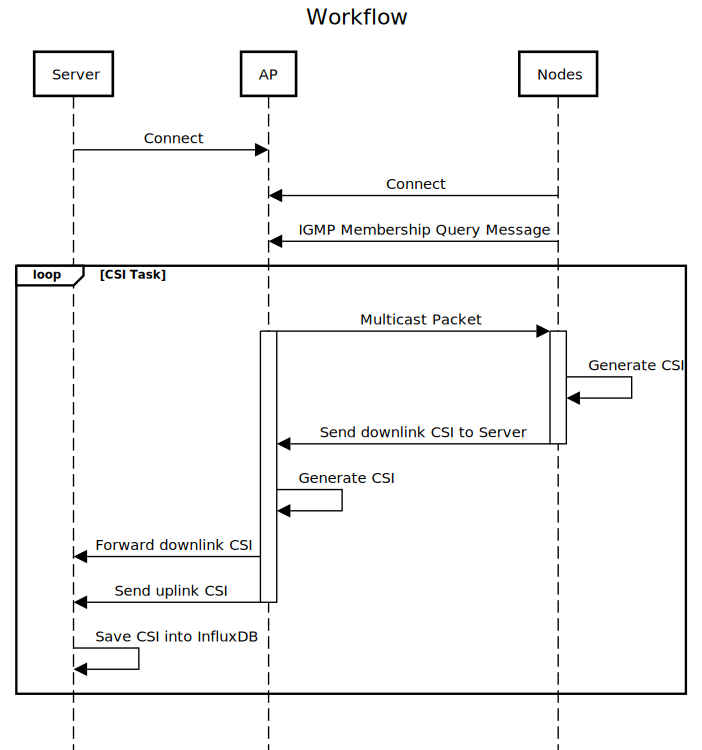

# ESP CSI Testbed
This project aims to develop a testbed for testing different WiFi sensing applications based on Channel State Information (CSI). It employs the ESP platform for the generation of CSI data and contains a framework for the centralized collection of said data from a number of nodes.

## Architecture

There are three main actors:
* one ESP32 node acting as an Acess Point (AP)
* one centralized host (Laptop, RespberryPi)
* a number of ESP32 nodes in station mode

The following sequence diagram demonstrates the workflow

## Acknowledgement

This project uses parts of [esp32-csi-server](https://github.com/roger-/esp32-csi-server) and [ESP32-CSI-Tool](https://github.com/StevenMHernandez/ESP32-CSI-Tool) in addition to the example on the [official ESP-IDF repo](https://github.com/espressif/esp-idf).